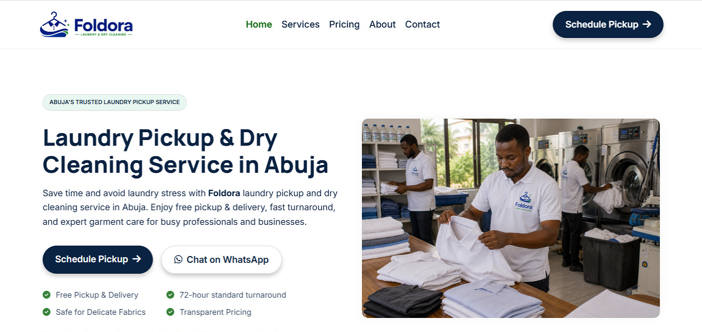
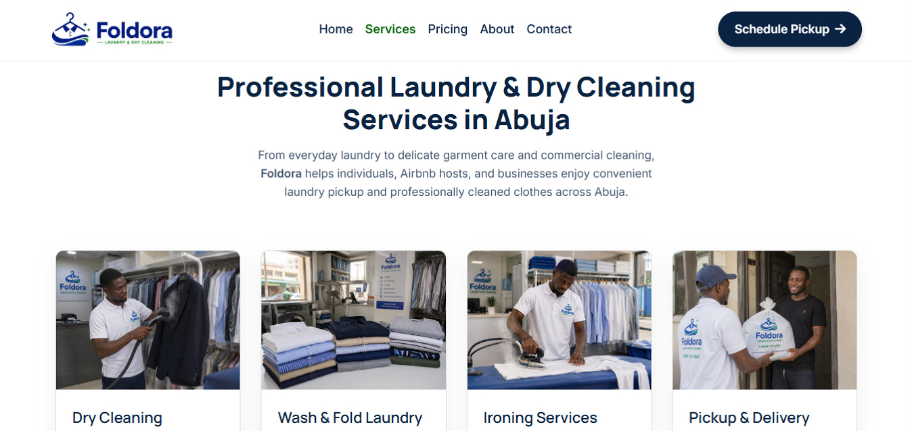
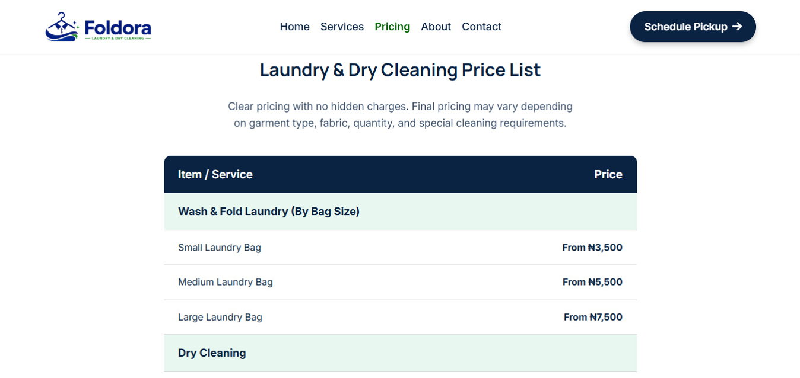
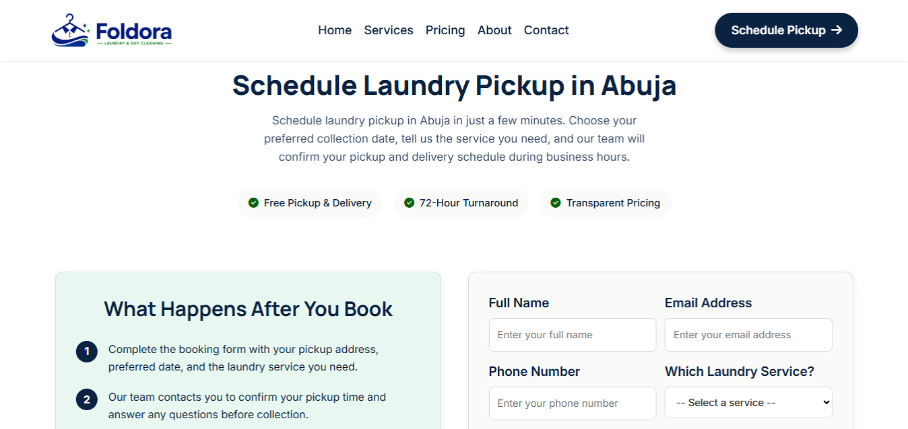

# Foldora – Laundry Pickup & Dry Cleaning Website

Foldora is a conversion-focused website concept designed for modern laundry and dry cleaning businesses.

Rather than functioning as an online brochure, the website is structured to answer customer questions, build trust, improve local search visibility, and encourage more pickup inquiries.

---

## 📸 Screenshots

### Foldora website hero section

### Foldora website services page

### Foldora website pricing page

### Foldora website booking page

---

## 🌐 Live Demo

[View the live site](https://foldoralaundry.vercel.app)

---

## Project Overview

Many laundry businesses rely heavily on WhatsApp, referrals, or social media.

However, potential customers often search online before making contact.

When they find no website, outdated information, or a confusing booking experience, trust decreases and inquiries are often lost.

Foldora was created to demonstrate how thoughtful UX, local SEO, and conversion-focused copywriting can help service businesses generate more inquiries online.

---

## Project Goals

This concept was designed to demonstrate how a modern laundry website can:

- Build trust from the first visit.
- Improve local search visibility.
- Make pricing easy to understand.
- Simplify the booking process.
- Encourage more pickup inquiries.
- Deliver a seamless mobile experience.

## The Conversion Strategy

Every page was designed around one question:

> What does a potential customer need to see before feeling confident enough to book?

Instead of focusing purely on aesthetics, the website reduces uncertainty and guides visitors toward scheduling a pickup.

The strategy focuses on five principles:

• Clear Value Proposition

Visitors immediately understand:
- what the business does
- who it serves
- where it operates

---

• Trust Building

The website reinforces credibility through:

- transparent pricing
- clear service explanations
- professional presentation
- consistent messaging
- visible calls-to-action

---

• Friction Reduction

The booking journey removes unnecessary steps.

Visitors can quickly:

- understand the service
- view pricing
- choose a pickup
- submit an inquiry

---

• Local SEO

Content reinforces Abuja throughout the website using:

- service-area mentions
- keyword-focused headings
- semantic HTML
- metadata
- internal linking

---

• Conversion-Focused Calls-to-Action

Each major page encourages users to take the next step through strategically placed "Schedule Pickup" actions.

---

## Key Features

✓ Homepage designed around customer intent

✓ Laundry services overview

✓ Transparent pricing page

✓ Commercial laundry section

✓ Service area coverage

✓ Contact page

✓ Online pickup booking form

✓ FAQ section

✓ Multiple conversion-focused CTAs

✓ Mobile-first responsive design

✓ Accessibility improvements

---

## SEO

The project includes:

- Semantic HTML5
- Optimized meta titles
- Meta descriptions
- Open Graph tags
- Twitter Cards
- Canonical URLs
- Structured heading hierarchy
- Keyword-focused content
- Internal linking
- Image alt text
- Local SEO targeting (Abuja)

---

## User Experience

Foldora prioritizes clarity over complexity.

UX decisions include:

- intuitive navigation
- clear page hierarchy
- readable typography
- simplified booking flow
- consistent button placement
- accessible forms
- mobile-first layouts

---

## Performance

The website was optimized using:

- WebP images
- Lazy loading
- Responsive images
- Lightweight CSS
- Optimized JavaScript
- Fast-loading assets

---

## Tech Stack

- HTML5
- CSS3
- JavaScript

---

## What This Project Demonstrates

This project demonstrates my approach to designing websites that help service businesses generate inquiries.

Rather than treating websites as digital brochures, I focus on combining:

- User Experience (UX)
- Conversion Optimization
- Local SEO
- Accessibility
- Performance

to create websites that support real business goals.

---

## Key Insight

Most service business websites don't struggle because people can't find them.

They struggle because visitors don't immediately trust them enough to take the next step.

Foldora was designed to reduce that uncertainty through clear messaging, intuitive navigation, and a straightforward booking experience.

---

## 👤 Author

**Chijioke Nwabasili**

Conversion-Focused Web Developer

Portfolio:
[chijiokenwabasili.vercel.app](https://chijiokenwabasili.vercel.app)
